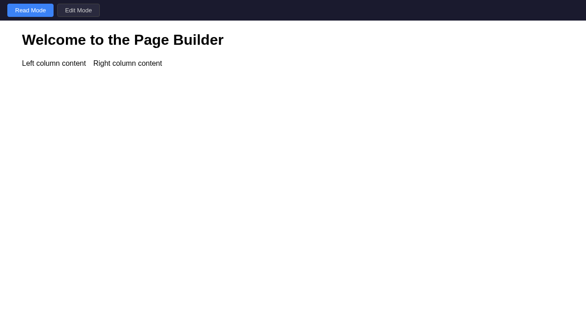
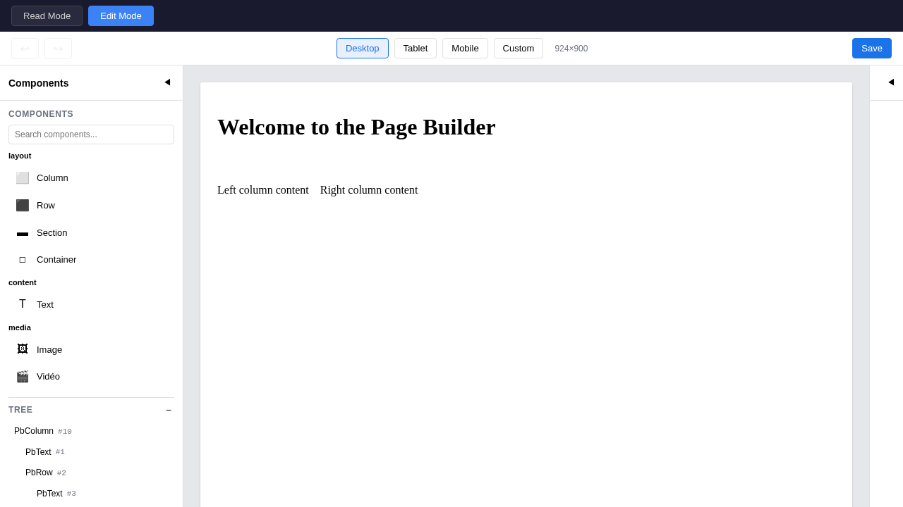

# @improba/page-builder

Bibliothèque Vue 3 pour construire et afficher des pages à partir d’un arbre JSON. Elle fournit un **mode lecture** (rendu statique, compatible SSR) et un **mode édition** (éditeur WYSIWYG avec palette de composants, panneau de propriétés, glisser-déposer, undo/redo). Le backend envoie un seul contrat JSON (`IPageData`) ; le frontend le rend et, en mode édition, permet de le modifier visuellement.

**En bref :** installez le plugin Vue, fournissez des données `IPageData`, et utilisez `<PageBuilder>` en `mode="read"` pour l’affichage ou `mode="edit"` pour l’édition. Vous pouvez enregistrer vos propres composants (hero, cartes, etc.) et les utiliser comme blocs dans l’arbre.

## Aperçu

**Mode lecture** — Rendu de la page sans interface d’édition (compatible SSR).



**Mode édition** — Éditeur WYSIWYG avec palette de composants, panneau de propriétés et prévisualisation responsive.



*Pour régénérer les captures : `docker compose -f docker/docker-compose.yml run --rm e2e sh -lc "npm install && npm run docs:screenshots"`.*

## Fonctionnalités

- **Mode lecture** — Rendu du contenu à partir d’un arbre JSON, compatible SSR. Intégrable dans Nuxt ou toute app Vue 3.
- **Mode édition** — Éditeur WYSIWYG avec palette de composants, panneau de propriétés, glisser-déposer, undo/redo et prévisualisation responsive (desktop / tablette / mobile).
- **Registre de composants** — Enregistrement de composants Vue personnalisés (props typées, slots, métadonnées d’édition). Livré avec des composants de mise en page et de contenu (PbColumn, PbRow, PbText, PbImage, etc.).
- **Contrat JSON unique** — Le backend envoie un seul payload `IPageData` ; le frontend le rend et l’édite. Séparation claire des responsabilités.

## Démarrage rapide

Pour un guide pas à pas (installation, premier rendu, mode édition, composants personnalisés), voir **[Quick Start](./docs/quickstart.md)**.

Résumé minimal :

### Installation

```bash
npm install @improba/page-builder
```

### Setup

```ts
import { createApp } from 'vue';
import { PageBuilderPlugin } from '@improba/page-builder';
import '@improba/page-builder/style.css';
import App from './App.vue';

const app = createApp(App);
app.use(PageBuilderPlugin);
app.mount('#app');
```

### Usage

```vue
<script setup lang="ts">
import { PageBuilder } from '@improba/page-builder';
import type { IPageData } from '@improba/page-builder';

const pageData: IPageData = {
  meta: { id: '1', name: 'Home', url: '/', status: 'published' },
  content: {
    id: 0,
    name: 'PbColumn',
    slot: null,
    props: { gap: '16px' },
    children: [
      {
        id: 1,
        name: 'PbText',
        slot: 'default',
        props: { content: '<h1>Hello World</h1>' },
        children: [],
      },
    ],
  },
  layout: { id: 100, name: 'PbContainer', slot: null, props: {}, children: [] },
  maxId: 100,
  variables: {},
};
</script>

<template>
  <PageBuilder :page-data="pageData" mode="read" />
</template>
```

### Edit Mode

```vue
<template>
  <PageBuilder
    :page-data="pageData"
    mode="edit"
    @save="handleSave"
    @change="handleChange"
  />
</template>
```

## Custom Components

Register your own components for the page builder:

```ts
import { registerComponent } from '@improba/page-builder';
import type { IComponentDefinition } from '@improba/page-builder';
import MyHero from './MyHero.vue';

const myHero: IComponentDefinition = {
  name: 'MyHero',
  label: 'Hero Banner',
  description: 'Full-width hero section with title and CTA.',
  category: 'content',
  component: MyHero,
  slots: [{ name: 'default', label: 'Content' }],
  editableProps: [
    { key: 'title', label: 'Title', type: 'text', required: true },
    { key: 'backgroundImage', label: 'Background', type: 'image' },
  ],
  defaultProps: { title: 'Hero Title' },
};

registerComponent(myHero);
```

## Built-in Components

| Component | Category | Description |
|-----------|----------|-------------|
| `PbColumn` | layout | Vertical flex container |
| `PbRow` | layout | Horizontal flex container |
| `PbSection` | layout | Full-width section with background |
| `PbContainer` | layout | Centered max-width container |
| `PbText` | content | Text/HTML block |
| `PbImage` | media | Image with sizing options |

## JSON Format

The page builder consumes a single `IPageData` JSON:

```ts
interface IPageData {
  meta: { id: string; name: string; url: string; status: string };
  content: INode;   // The page content tree
  layout: INode;    // The page layout wrapper
  maxId: number;    // For generating unique IDs
  variables: Record<string, string>;  // Template variables
}

interface INode {
  id: number;
  name: string;         // Must match a registered component
  slot: string | null;  // Target slot in parent
  props: Record<string, unknown>;
  children: INode[];
  readonly?: boolean;
}
```

Props support template variables: `{{ PAGE_NAME }}` is replaced at render time.

## Development

**All commands run through Docker** (see [AGENTS.md](./AGENTS.md) for details):

```bash
# Start dev server with hot reload
docker compose -f docker/docker-compose.yml up dev

# Run tests
docker compose -f docker/docker-compose.yml run --rm test

# Run Playwright end-to-end tests
docker compose -f docker/docker-compose.yml run --rm e2e sh -lc "npm install && npm run test:e2e"

# Build the library
docker compose -f docker/docker-compose.yml run --rm build

# Generate API reference docs (TypeDoc)
docker compose -f docker/docker-compose.yml run --rm dev npm run docs:api

# Install a new dependency
docker compose -f docker/docker-compose.yml run --rm dev npm install <package>
```

The dev server starts a Vite playground at `http://localhost:5173` with a demo page for testing components.

### End-to-End Tests (Playwright)

E2E tests live in `tests/e2e/` and run against the playground via Playwright's `webServer` integration.

```bash
# Full E2E suite in Docker/CI
docker compose -f docker/docker-compose.yml run --rm e2e sh -lc "npm install && npm run test:e2e"

# Smoke workflow only (mode switch -> node selection -> prop edit -> save)
docker compose -f docker/docker-compose.yml run --rm e2e sh -lc "npm install && npm run test:e2e:smoke"
```

The `e2e` Docker image already includes Playwright browsers. If you need to (re)install browser binaries explicitly, run:

```bash
docker compose -f docker/docker-compose.yml run --rm e2e npm run e2e:install
```

## Documentation

Toute la documentation se trouve dans `docs/` :

| Document | Description |
|----------|-------------|
| **[Quick Start](./docs/quickstart.md)** | Démarrer rapidement : installation, configuration, premier rendu, mode édition, API |
| **[Architecture](./docs/architecture/)** | Vue d’ensemble, schéma JSON, système de composants, pipeline de rendu, architecture du mode édition |
| **[Fonctionnalités](./docs/features/)** | Mode lecture, mode édition, registre de composants, format JSON |
| **[Conventions](./docs/conventions/)** | Style de code, workflow git |
| **[Roadmap](./docs/plans/roadmap.md)** | Phases et jalons |
| **[Référence API](./docs/api/)** | Sortie TypeDoc (types et fonctions publics) |

Pour régénérer la référence API :

```bash
docker compose -f docker/docker-compose.yml run --rm dev npm run docs:api
```

## Releases

Releases are automated via GitHub Actions with [Release Please](https://github.com/googleapis/release-please).

### Semantic versioning strategy

- `fix:` -> patch release
- `feat:` -> minor release
- `feat!:` or `BREAKING CHANGE:` -> major release

### Automated release flow

1. Merge conventional-commit PRs into `main`.
2. The `Release` workflow runs a quality gate first (`npm run release:prepare` + `npm run release:dry-run`).
3. If the gate passes, Release Please opens/updates the release PR with version bumps and changelog updates.
4. Merge the release PR to trigger the workflow again; after the same gate passes, Release Please creates the git tag and GitHub Release.
5. The publish job checks out the tag, reruns release safety checks, and publishes to npm.

### Required repository secrets

- `NPM_TOKEN` (npm automation token with publish permission on `@improba/page-builder`)

### Local release verification (Docker)

```bash
# Full release safety gate (typecheck + tests + build + types + docs)
docker compose -f docker/docker-compose.yml run --rm dev npm run release:prepare

# Inspect package contents before publish
docker compose -f docker/docker-compose.yml run --rm dev npm run release:dry-run
```

## API Reference

### Vue Plugin

```ts
app.use(PageBuilderPlugin, {
  components: [],        // Additional IComponentDefinition[]
  registerBuiltIn: true, // Register PbColumn, PbRow, etc.
  globalName: 'PageBuilder', // Global component name (false to skip)
});
```

### Registry Functions

| Function | Description |
|----------|-------------|
| `registerComponent(def)` | Register a single component |
| `registerComponents(defs)` | Register multiple components |
| `replaceComponent(def)` | Override an existing registration |
| `unregisterComponent(name)` | Remove a registration |
| `getComponent(name)` | Get definition by name |
| `resolveComponent(name)` | Get Vue component (throws if missing) |
| `getRegisteredComponents()` | Get all definitions |
| `getComponentsByCategory()` | Get definitions grouped by category |
| `hasComponent(name)` | Check if registered |
| `clearRegistry()` | Remove all (testing) |

### Tree Utilities

| Function | Description |
|----------|-------------|
| `findNodeById(root, id)` | Find node in tree |
| `findParent(root, childId)` | Find parent of node |
| `removeNode(root, id)` | Remove node from tree |
| `insertNode(root, parentId, node, index, slot)` | Insert node |
| `moveNode(root, nodeId, parentId, index, slot)` | Move node |
| `createNode(id, name, options)` | Create new node |
| `walkTree(root, visitor)` | Depth-first traversal |
| `cloneTree(node)` | Deep clone |
| `interpolateProps(props, vars)` | Replace template variables |

### Composables

| Composable | Purpose |
|------------|---------|
| `usePageBuilder(options)` | Core state management (mode, content, history) |
| `useEditor()` | Editor UI state (selection, drawers, viewport) |
| `useNodeTree(options)` | Tree mutation operations |
| `useDragDrop()` | Drag-and-drop interaction state |

## License

MIT
